# MESH Ingestion System Design Document

## Overview

The MESH (Multi-platform External Source Hub) Ingestion System is designed as a scalable, AI-powered agentic platform that provides real-time message ingestion, intelligent analysis, and proactive memory capabilities across multiple communication platforms. The system follows a microservices architecture with event-driven processing, ensuring high availability, security, and performance.

### Key Design Principles

- **Real-time First**: Sub-5-second latency for message ingestion and processing
- **AI-Native**: Every component leverages AI agents for intelligent processing
- **Security by Design**: Military-grade encryption and privacy-preserving techniques
- **Platform Agnostic**: Unified schema supporting diverse communication platforms
- **Scalable Architecture**: Horizontal scaling with microservices and event streaming
- **Fault Tolerant**: Comprehensive error handling, retries, and dead letter queues

## Architecture

### High-Level Architecture

```mermaid
graph TB
    subgraph "External Platforms"
        Gmail[Gmail API]
        Slack[Slack Events API]
        Discord[Discord Gateway]
        WhatsApp[WhatsApp via Matrix]
        Twitter[Twitter API]
        Telegram[Telegram Bot API]
        GChat[Google Chat API]
        LinkedIn[LinkedIn via Matrix]
        Instagram[Instagram via Matrix]
    end

    subgraph "Ingestion Layer"
        ConnectorManager[Connector Manager]
        GmailConnector[Gmail Connector]
        SlackConnector[Slack Connector]
        DiscordConnector[Discord Connector]
        MatrixBridge[Matrix Bridge Hub]
        TwitterConnector[Twitter Connector]
        TelegramConnector[Telegram Connector]
    end

    subgraph "Message Processing Pipeline"
        EventBus[Event Bus - Redis Streams]
        MessageNormalizer[Message Normalizer]
        AIProcessor[AI Processing Engine]
        EntityExtractor[Entity Extraction Agent]
        SummaryAgent[Summary Generation Agent]
        ActionItemAgent[Action Item Detection Agent]
    end

    subgraph "Storage Layer"
        PostgreSQL[(PostgreSQL - Canonical Data)]
        VectorDB[(Vector DB - Embeddings)]
        BlobStorage[(Blob Storage - Attachments)]
        Redis[(Redis - Cache/Queues)]
    end

    subgraph "AI Agents Layer"
        ContextAgent[Context Management Agent]
        ProactiveAgent[Proactive Memory Agent]
        SearchAgent[Hybrid Search Agent]
        InsightAgent[Insight Generation Agent]
    end

    subgraph "API Layer"
        GraphQLAPI[GraphQL API]
        RESTAPI[REST API]
        WebSocketAPI[WebSocket API - Real-time]
    end

    subgraph "Security Layer"
        TokenVault[Token Vault - KMS]
        EncryptionService[Field-Level Encryption]
        AuditLogger[Audit Logger]
        PIIRedactor[PII Redaction Service]
    end

    Gmail --> GmailConnector
    Slack --> SlackConnector
    Discord --> DiscordConnector
    WhatsApp --> MatrixBridge
    Twitter --> TwitterConnector
    Telegram --> TelegramConnector
    GChat --> GmailConnector
    LinkedIn --> MatrixBridge
    Instagram --> MatrixBridge

    ConnectorManager --> EventBus
    GmailConnector --> EventBus
    SlackConnector --> EventBus
    DiscordConnector --> EventBus
    MatrixBridge --> EventBus
    TwitterConnector --> EventBus
    TelegramConnector --> EventBus

    EventBus --> MessageNormalizer
    MessageNormalizer --> AIProcessor
    AIProcessor --> EntityExtractor
    AIProcessor --> SummaryAgent
    AIProcessor --> ActionItemAgent

    EntityExtractor --> PostgreSQL
    SummaryAgent --> PostgreSQL
    ActionItemAgent --> PostgreSQL
    MessageNormalizer --> PostgreSQL
    AIProcessor --> VectorDB
    MessageNormalizer --> BlobStorage

    ContextAgent --> PostgreSQL
    ContextAgent --> VectorDB
    ProactiveAgent --> PostgreSQL
    SearchAgent --> PostgreSQL
    SearchAgent --> VectorDB
    InsightAgent --> PostgreSQL
    InsightAgent --> VectorDB

    GraphQLAPI --> ContextAgent
    RESTAPI --> SearchAgent
    WebSocketAPI --> ProactiveAgent

    TokenVault --> ConnectorManager
    EncryptionService --> PostgreSQL
    AuditLogger --> PostgreSQL
    PIIRedactor --> AIProcessor
```



### Event-Driven Architecture

The system uses Redis Streams as the central event bus, enabling:
- **Real-time message flow** with guaranteed delivery
- **Horizontal scaling** of processing components
- **Fault tolerance** with consumer groups and acknowledgments
- **Event replay** capabilities for debugging and recovery

## Components and Interfaces

### 1. Connector Manager

**Purpose**: Orchestrates all platform connectors and manages their lifecycle.

**Key Responsibilities**:
- Health monitoring of all connectors
- Rate limit coordination across platforms
- Connector restart and recovery
- Authentication token refresh management

**Interface**:
```python
class ConnectorManager:
    async def register_connector(self, connector: BaseConnector) -> None
    async def start_all_connectors(self) -> None
    async def stop_connector(self, platform: str) -> None
    async def get_connector_health(self) -> Dict[str, ConnectorHealth]
    async def refresh_tokens(self, platform: str) -> None
```

### 2. Platform Connectors

**Base Connector Interface**:
```python
class BaseConnector:
    async def authenticate(self, credentials: Dict) -> bool
    async def start_real_time_ingestion(self) -> None
    async def fetch_historical_messages(self, cursor: str) -> List[RawMessage]
    async def handle_webhook(self, payload: Dict) -> None
    async def get_health_status(self) -> ConnectorHealth
```

**Gmail Connector**:
- Uses Gmail API with push notifications
- Implements OAuth 2.0 with refresh token management
- Supports both real-time webhooks and polling fallback

**Slack Connector**:
- Uses Slack Events API for real-time events
- Implements Socket Mode for enterprise installations
- Handles rate limiting with exponential backoff

**Matrix Bridge Hub**:
- Manages multiple Matrix bridges (WhatsApp, Instagram, LinkedIn)
- Handles bridge authentication and session management
- Provides unified interface for Matrix-based platforms

### 3. Message Normalizer

**Purpose**: Converts platform-specific message formats to unified schema.

**Unified Message Schema**:
```python
@dataclass
class NormalizedMessage:
    id: str
    platform: str
    thread_id: str
    sender: Participant
    recipients: List[Participant]
    content: MessageContent
    attachments: List[Attachment]
    timestamp: datetime
    metadata: Dict[str, Any]
    raw_data: Dict[str, Any]  # Original platform data
```

**Content Processing**:
- MIME type cleaning and standardization
- Rich text to markdown conversion
- Media extraction and blob storage
- Link preview generation

### 4. AI Processing Engine

**Purpose**: Coordinates all AI agents and manages processing workflows.

**AI Agent Orchestration**:
```python
class AIProcessingEngine:
    async def process_message(self, message: NormalizedMessage) -> ProcessingResult
    async def generate_summary(self, thread_id: str, timeframe: str) -> Summary
    async def extract_entities(self, content: str) -> List[Entity]
    async def detect_action_items(self, message: NormalizedMessage) -> List[ActionItem]
    async def update_context(self, message: NormalizedMessage) -> None
```

**LLM Integration**:
- OpenAI GPT-4 for text understanding and generation
- Anthropic Claude for complex reasoning tasks
- Local models (Llama 2/3) for privacy-sensitive processing
- Embedding models for vector search (OpenAI Ada-002, Sentence Transformers)

### 5. Entity Extraction Agent

**Purpose**: Identifies and extracts structured information from messages.

**Entity Types**:
- **People**: Names, roles, contact information
- **Organizations**: Companies, departments, teams
- **Dates/Times**: Meetings, deadlines, events
- **Tasks**: Action items, commitments, deliverables
- **Files**: Documents, links, shared resources
- **Topics**: Projects, subjects, keywords

**Processing Pipeline**:
1. Named Entity Recognition (NER) using spaCy/Transformers
2. LLM-based entity validation and enrichment
3. Entity linking and relationship mapping
4. Confidence scoring and human review flagging

### 6. Summary Generation Agent

**Purpose**: Creates intelligent summaries at multiple granularities.

**Summary Types**:
- **Micro-summaries**: Real-time, single message context
- **Thread summaries**: Conversation-level insights
- **Daily summaries**: Per-contact and per-topic rollups
- **Weekly summaries**: Trend analysis and relationship insights

**Generation Strategy**:
- Streaming summaries for active conversations
- Batch processing for historical data
- Incremental updates as new messages arrive
- Context-aware summarization with memory

### 7. Proactive Memory Agent

**Purpose**: Provides intelligent, context-aware assistance and reminders.

**Capabilities**:
- **Follow-up Detection**: Identifies pending commitments
- **Relationship Insights**: Tracks communication patterns
- **File Tracking**: Maintains shared resource history
- **Nudge Generation**: Creates timely reminders
- **Contact Dossiers**: Builds comprehensive contact profiles

**Memory Architecture**:
```python
class ProactiveMemoryAgent:
    async def track_commitment(self, commitment: Commitment) -> None
    async def generate_nudges(self, user_id: str) -> List[Nudge]
    async def update_contact_dossier(self, contact: str, interaction: Interaction) -> None
    async def suggest_follow_ups(self, context: ConversationContext) -> List[Suggestion]
```

### 8. Hybrid Search Agent

**Purpose**: Provides intelligent search across all message data.

**Search Architecture**:
- **Lexical Search**: PostgreSQL full-text search with ranking
- **Vector Search**: Semantic similarity using embeddings
- **Hybrid Fusion**: Combines lexical and vector results with learned weights
- **Context Enhancement**: Uses conversation context for better results

**Search Interface**:
```python
class HybridSearchAgent:
    async def search(self, query: str, filters: SearchFilters) -> SearchResults
    async def find_commitments(self, person: str, topic: str, timeframe: str) -> List[Commitment]
    async def find_shared_files(self, contact: str, file_type: str) -> List[SharedFile]
    async def semantic_search(self, query: str, limit: int) -> List[SemanticMatch]
```

## Data Models

### Core Entities

**Message Model**:
```sql
CREATE TABLE messages (
    id UUID PRIMARY KEY,
    platform VARCHAR(50) NOT NULL,
    platform_message_id VARCHAR(255) NOT NULL,
    thread_id UUID NOT NULL,
    sender_id UUID NOT NULL,
    content_text TEXT,
    content_html TEXT,
    content_markdown TEXT,
    timestamp TIMESTAMPTZ NOT NULL,
    metadata JSONB,
    raw_data JSONB,
    created_at TIMESTAMPTZ DEFAULT NOW(),
    updated_at TIMESTAMPTZ DEFAULT NOW(),
    UNIQUE(platform, platform_message_id)
);
```

**Thread Model**:
```sql
CREATE TABLE threads (
    id UUID PRIMARY KEY,
    platform VARCHAR(50) NOT NULL,
    platform_thread_id VARCHAR(255) NOT NULL,
    title VARCHAR(500),
    participants UUID[] NOT NULL,
    last_message_at TIMESTAMPTZ,
    message_count INTEGER DEFAULT 0,
    metadata JSONB,
    created_at TIMESTAMPTZ DEFAULT NOW(),
    updated_at TIMESTAMPTZ DEFAULT NOW(),
    UNIQUE(platform, platform_thread_id)
);
```

**Participant Model**:
```sql
CREATE TABLE participants (
    id UUID PRIMARY KEY,
    platform VARCHAR(50) NOT NULL,
    platform_user_id VARCHAR(255) NOT NULL,
    display_name VARCHAR(255),
    email VARCHAR(255),
    phone VARCHAR(50),
    avatar_url TEXT,
    metadata JSONB,
    created_at TIMESTAMPTZ DEFAULT NOW(),
    updated_at TIMESTAMPTZ DEFAULT NOW(),
    UNIQUE(platform, platform_user_id)
);
```

**Entity Model**:
```sql
CREATE TABLE entities (
    id UUID PRIMARY KEY,
    type VARCHAR(50) NOT NULL, -- person, organization, date, task, file, topic
    value TEXT NOT NULL,
    normalized_value TEXT,
    confidence FLOAT,
    metadata JSONB,
    created_at TIMESTAMPTZ DEFAULT NOW()
);
```

**Summary Model**:
```sql
CREATE TABLE summaries (
    id UUID PRIMARY KEY,
    type VARCHAR(50) NOT NULL, -- micro, thread, daily, weekly
    scope_type VARCHAR(50) NOT NULL, -- message, thread, contact, global
    scope_id UUID,
    content TEXT NOT NULL,
    key_points TEXT[],
    action_items TEXT[],
    entities UUID[],
    timeframe_start TIMESTAMPTZ,
    timeframe_end TIMESTAMPTZ,
    created_at TIMESTAMPTZ DEFAULT NOW()
);
```

### Vector Storage Schema

**Message Embeddings**:
```python
# Stored in Chroma/Weaviate
{
    "id": "message_uuid",
    "embedding": [0.1, 0.2, ...],  # 1536-dim vector
    "metadata": {
        "platform": "gmail",
        "sender": "john@example.com",
        "timestamp": "2024-01-15T10:30:00Z",
        "thread_id": "thread_uuid",
        "content_preview": "First 200 chars...",
        "entities": ["person:John", "company:Acme"]
    }
}
```

## Error Handling

### Fault Tolerance Strategy

**Circuit Breaker Pattern**:
- Prevents cascade failures across connectors
- Automatic recovery with exponential backoff
- Health check endpoints for monitoring

**Dead Letter Queue (DLQ)**:
- Failed messages queued for manual review
- Automatic retry with increasing delays
- Poison message detection and isolation

**Graceful Degradation**:
- Core functionality continues during partial failures
- Fallback to cached data when services unavailable
- User notification of service limitations

### Error Categories

**Transient Errors**:
- Network timeouts → Exponential backoff retry
- Rate limiting → Respect platform limits with queuing
- Temporary API unavailability → Circuit breaker activation

**Permanent Errors**:
- Authentication failures → User notification and re-auth flow
- Malformed data → DLQ with manual review
- Platform API changes → Connector update required

**Security Errors**:
- Token expiration → Automatic refresh with fallback
- Permission denied → User notification and scope review
- Suspicious activity → Automatic security lockdown

## Testing Strategy

### Unit Testing

**Component Testing**:
- Individual connector functionality
- Message normalization accuracy
- AI agent processing logic
- Search algorithm effectiveness

**Mock Strategy**:
- Platform API responses
- Database interactions
- AI model responses
- External service calls

### Integration Testing

**End-to-End Flows**:
- Message ingestion to storage pipeline
- Real-time processing workflows
- Search and retrieval operations
- AI agent coordination

**Platform Testing**:
- OAuth flows for each platform
- Webhook handling and validation
- Rate limiting behavior
- Error recovery scenarios

### Performance Testing

**Load Testing**:
- High-volume message ingestion
- Concurrent user search queries
- AI processing under load
- Database performance optimization

**Scalability Testing**:
- Horizontal scaling validation
- Resource utilization monitoring
- Bottleneck identification
- Capacity planning

### Security Testing

**Penetration Testing**:
- API endpoint security
- Authentication bypass attempts
- Data injection attacks
- Privilege escalation tests

**Privacy Testing**:
- PII redaction effectiveness
- Encryption key management
- Data isolation validation
- Compliance verification

## Security Architecture

### Encryption Strategy

**Data at Rest**:
- PostgreSQL: Transparent Data Encryption (TDE)
- Field-level encryption for PII using AES-256-GCM
- Vector DB: Encrypted storage with customer-managed keys
- Blob storage: Server-side encryption with KMS

**Data in Transit**:
- TLS 1.3 for all external communications
- mTLS for internal service communication
- End-to-end encryption for sensitive data flows
- Certificate pinning for platform APIs

**Key Management**:
- AWS KMS or HashiCorp Vault for key storage
- Automatic key rotation every 90 days
- Hardware Security Module (HSM) for critical keys
- Zero-knowledge architecture where possible

### Privacy-Preserving AI

**PII Redaction Pipeline**:
```python
class PIIRedactor:
    async def redact_for_embedding(self, text: str) -> str
    async def redact_for_summary(self, text: str) -> str
    async def identify_sensitive_entities(self, text: str) -> List[PIIEntity]
    async def apply_differential_privacy(self, data: Any) -> Any
```

**Techniques**:
- Named entity recognition for PII detection
- Differential privacy for aggregate analytics
- Federated learning for model improvements
- Homomorphic encryption for sensitive computations

### Access Control

**Multi-Tenant Isolation**:
- Row-level security in PostgreSQL
- Tenant-specific encryption keys
- API rate limiting per tenant
- Resource quotas and monitoring

**Role-Based Access Control (RBAC)**:
- Fine-grained permissions system
- API key management with scopes
- Audit logging for all access
- Just-in-time access for operations

## Operational Considerations

### Monitoring and Observability

**Metrics Collection**:
- Prometheus for metrics aggregation
- Grafana for visualization and alerting
- Custom dashboards for business metrics
- Real-time performance monitoring

**Key Metrics**:
- Message ingestion rate and latency
- AI processing time and accuracy
- Search query performance
- Error rates by component
- Resource utilization trends

**Logging Strategy**:
- Structured logging with correlation IDs
- Centralized log aggregation (ELK stack)
- Log retention policies by sensitivity
- Real-time log analysis and alerting

### Deployment Architecture

**Container Orchestration**:
- Kubernetes for service orchestration
- Docker containers for all services
- Helm charts for deployment management
- GitOps workflow with ArgoCD

**Scaling Strategy**:
- Horizontal Pod Autoscaling (HPA)
- Vertical Pod Autoscaling (VPA)
- Custom metrics for AI workload scaling
- Database read replicas for query scaling

### Disaster Recovery

**Backup Strategy**:
- Continuous PostgreSQL replication
- Vector DB snapshots every 6 hours
- Blob storage cross-region replication
- Configuration backup and versioning

**Recovery Procedures**:
- RTO: 15 minutes for critical services
- RPO: 5 minutes for message data
- Automated failover for database
- Manual failover for complex services

## Technology Stack

### Core Infrastructure
- **Container Platform**: Kubernetes
- **Service Mesh**: Istio for traffic management
- **API Gateway**: Kong or Envoy Proxy
- **Message Queue**: Redis Streams
- **Caching**: Redis Cluster

### Data Storage
- **Primary Database**: PostgreSQL 16 with extensions
- **Vector Database**: Chroma or Weaviate
- **Blob Storage**: AWS S3 or Supabase Storage
- **Search Engine**: PostgreSQL Full-Text + Vector similarity

### AI/ML Stack
- **LLM APIs**: OpenAI GPT-4, Anthropic Claude
- **Local Models**: Llama 2/3 via Ollama
- **Embedding Models**: OpenAI Ada-002, Sentence Transformers
- **ML Pipeline**: Apache Airflow for batch processing

### Security & Monitoring
- **Key Management**: AWS KMS or HashiCorp Vault
- **Monitoring**: Prometheus + Grafana
- **Logging**: ELK Stack (Elasticsearch, Logstash, Kibana)
- **Tracing**: Jaeger for distributed tracing

## Coding Standards and Patterns

### Code Quality Standards

**Line Length and Readability**:
- Maximum line length: 88 characters (Black formatter standard)
- Break long lines at logical points (parameters, method chains, conditions)
- Use parentheses for natural line breaks in expressions
- Prefer multiple short lines over single long lines

**Function and Method Design**:
- Single Responsibility Principle: Each function should do one thing well
- Maximum function length: 20-25 lines (excluding docstrings)
- Maximum parameter count: 5 parameters (use dataclasses/TypedDict for more)
- Pure functions preferred where possible (no side effects)

**Class Design**:
- Maximum class length: 200 lines
- Use composition over inheritance
- Implement proper `__str__` and `__repr__` methods
- Use dataclasses for simple data containers

### Modularization Patterns

**Service Layer Architecture**:
```python
# Good: Modular service with clear separation
class MessageNormalizer:
    def __init__(self, content_processor: ContentProcessor, 
                 entity_extractor: EntityExtractor):
        self._content_processor = content_processor
        self._entity_extractor = entity_extractor
    
    async def normalize(self, raw_message: RawMessage) -> NormalizedMessage:
        content = await self._process_content(raw_message)
        entities = await self._extract_entities(content)
        return self._build_normalized_message(content, entities)
```

**Dependency Injection**:
- Use dependency injection for all external dependencies
- Create interfaces/protocols for all major components
- Use factory patterns for complex object creation

**Error Handling Patterns**:
```python
# Consistent error handling with proper logging
async def process_message(self, message: RawMessage) -> ProcessingResult:
    try:
        normalized = await self._normalize_message(message)
        result = await self._ai_process(normalized)
        await self._store_result(result)
        return ProcessingResult.success(result)
    except ValidationError as e:
        logger.warning(f"Message validation failed: {e}", extra={"message_id": message.id})
        return ProcessingResult.validation_error(str(e))
    except ExternalServiceError as e:
        logger.error(f"External service failed: {e}", extra={"service": e.service})
        return ProcessingResult.service_error(str(e))
    except Exception as e:
        logger.exception(f"Unexpected error processing message: {e}")
        return ProcessingResult.system_error(str(e))
```

### Naming Conventions

**Variables and Functions**:
- Use descriptive names: `user_message_count` not `umc`
- Boolean variables: `is_active`, `has_attachments`, `can_process`
- Functions: Verb phrases `process_message`, `extract_entities`
- Constants: `MAX_RETRY_ATTEMPTS`, `DEFAULT_TIMEOUT_SECONDS`

**Classes and Modules**:
- Classes: PascalCase `MessageProcessor`, `AIAgent`
- Modules: snake_case `message_processor.py`, `ai_agents.py`
- Packages: snake_case `platform_connectors`, `ai_processing`

### Type Annotations and Documentation

**Type Hints**:
```python
from typing import Dict, List, Optional, Union, Protocol
from dataclasses import dataclass

@dataclass
class ProcessingResult:
    success: bool
    data: Optional[Dict[str, Any]] = None
    error: Optional[str] = None
    metadata: Dict[str, Any] = field(default_factory=dict)

async def process_messages(
    messages: List[RawMessage],
    processor: MessageProcessor,
    batch_size: int = 100
) -> List[ProcessingResult]:
    """Process a batch of messages with the given processor."""
```

**Docstring Standards**:
- Use Google-style docstrings
- Include parameter types and descriptions
- Document return values and exceptions
- Add usage examples for complex functions

### Async/Await Patterns

**Proper Async Usage**:
```python
# Good: Proper async context management
async def process_batch(self, messages: List[RawMessage]) -> List[ProcessingResult]:
    async with self._db_session() as session:
        tasks = [self._process_single(msg, session) for msg in messages]
        results = await asyncio.gather(*tasks, return_exceptions=True)
        return [self._handle_result(r) for r in results]

# Good: Resource cleanup with async context managers
async def fetch_with_retry(self, url: str) -> Dict[str, Any]:
    async with aiohttp.ClientSession() as session:
        for attempt in range(self.max_retries):
            try:
                async with session.get(url) as response:
                    return await response.json()
            except aiohttp.ClientError as e:
                if attempt == self.max_retries - 1:
                    raise
                await asyncio.sleep(2 ** attempt)
```

### Configuration Management

**Environment-Based Config**:
```python
from pydantic import BaseSettings, Field

class Settings(BaseSettings):
    database_url: str = Field(..., env="DATABASE_URL")
    redis_url: str = Field("redis://localhost:6379", env="REDIS_URL")
    openai_api_key: str = Field(..., env="OPENAI_API_KEY")
    max_message_batch_size: int = Field(100, env="MAX_MESSAGE_BATCH_SIZE")
    
    class Config:
        env_file = ".env"
        case_sensitive = False
```

### Testing Patterns

**Test Structure**:
```python
# Arrange-Act-Assert pattern
async def test_message_normalization():
    # Arrange
    raw_message = create_test_raw_message(platform="gmail")
    normalizer = MessageNormalizer(mock_content_processor, mock_entity_extractor)
    
    # Act
    result = await normalizer.normalize(raw_message)
    
    # Assert
    assert result.platform == "gmail"
    assert result.content.text is not None
    assert len(result.entities) > 0
```

**Mock Patterns**:
- Use pytest-asyncio for async test support
- Create reusable test fixtures
- Mock external dependencies consistently
- Use factory patterns for test data creation

### Performance Patterns

**Database Queries**:
```python
# Good: Efficient batch operations
async def store_messages_batch(self, messages: List[NormalizedMessage]) -> None:
    async with self._db.begin() as conn:
        await conn.execute(
            insert(messages_table),
            [msg.to_dict() for msg in messages]
        )

# Good: Proper connection pooling
class DatabaseManager:
    def __init__(self, database_url: str):
        self._engine = create_async_engine(
            database_url,
            pool_size=20,
            max_overflow=30,
            pool_pre_ping=True
        )
```

**Memory Management**:
- Use generators for large data processing
- Implement proper cleanup in async context managers
- Monitor memory usage in long-running processes
- Use connection pooling for external services

### Security Patterns

**Input Validation**:
```python
from pydantic import BaseModel, validator

class MessageInput(BaseModel):
    content: str
    platform: str
    sender_id: str
    
    @validator('content')
    def validate_content(cls, v):
        if len(v) > 10000:  # 10KB limit
            raise ValueError('Message content too large')
        return v.strip()
    
    @validator('platform')
    def validate_platform(cls, v):
        allowed_platforms = {'gmail', 'slack', 'discord', 'whatsapp'}
        if v not in allowed_platforms:
            raise ValueError(f'Unsupported platform: {v}')
        return v
```

**Secure Data Handling**:
- Never log sensitive data (tokens, PII)
- Use secure random generation for IDs
- Implement proper session management
- Validate all external inputs

This design provides a comprehensive foundation for building the MESH Ingestion System with enterprise-grade security, scalability, and AI capabilities while maintaining the flexibility to adapt to evolving requirements and platform changes.