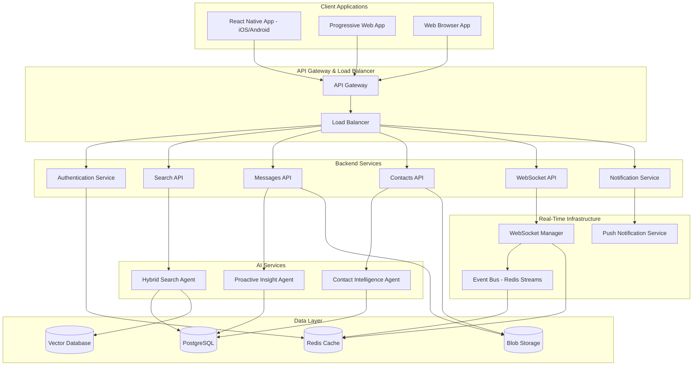
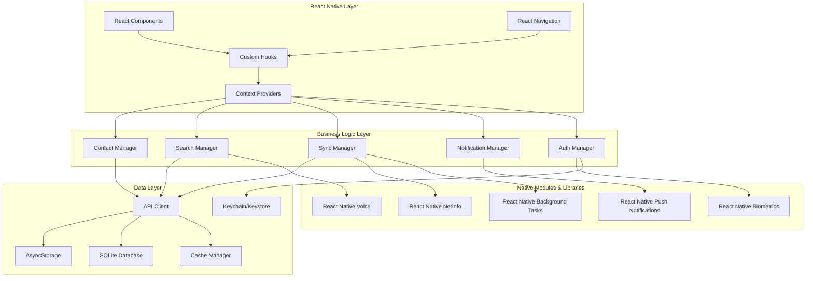
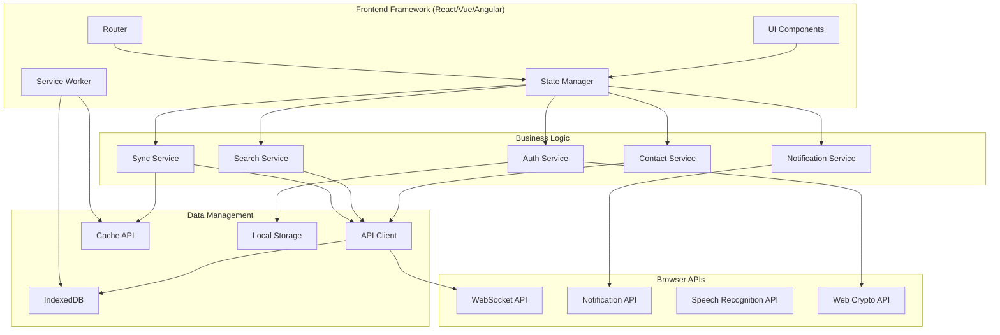

# Mobile and Web App Integration Design Document

## Overview

The Mobile and Web App Integration extends the R.E.M.I (Real-time External Memory Interface) system with comprehensive frontend applications that provide intelligent contact-based auto-search, real-time synchronization, and cross-platform communication insights. The design follows a modern, scalable architecture with a React Native mobile app (iOS/Android), a progressive web application, and seamless synchronization across all platforms.

### Key Design Principles

- **Contact-First Design**: Every interface prioritizes contact-based interactions and search
- **Cross-Platform Consistency**: Unified experience across mobile and web with platform-specific optimizations
- **Real-Time Synchronization**: Instant updates and state synchronization across all devices
- **Offline-First Architecture**: Robust offline capabilities with intelligent caching and sync
- **Performance Optimization**: Efficient resource usage and fast response times
- **Security by Design**: End-to-end encryption and privacy-preserving features
- **Accessibility Compliance**: Full support for screen readers, keyboard navigation, and assistive technologies

## Architecture

### High-Level System Architecture



### React Native Application Architecture



### Web Application Architecture



## Components and Interfaces

### 1. Contact Intelligence System

**Purpose**: Provides intelligent contact-based search and relationship insights across all platforms.

**Core Components**:

#### Contact Manager
```typescript
interface ContactManager {
  // Contact search and retrieval
  searchContacts(query: string, options?: SearchOptions): Promise<Contact[]>;
  getContact(contactId: string): Promise<Contact>;
  getUnifiedContact(identifiers: ContactIdentifier[]): Promise<UnifiedContact>;
  
  // Contact-based message search
  searchMessagesByContact(contactId: string, filters?: MessageFilters): Promise<Message[]>;
  getConversationHistory(contactId: string, platformFilter?: string[]): Promise<ConversationThread[]>;
  getSharedFiles(contactId: string, fileType?: string): Promise<SharedFile[]>;
  
  // Relationship insights
  getContactInsights(contactId: string): Promise<ContactInsights>;
  getCommunicationPatterns(contactId: string): Promise<CommunicationPattern[]>;
  getRelationshipStrength(contactId: string): Promise<RelationshipMetrics>;
  
  // Contact management
  mergeContacts(primaryId: string, duplicateIds: string[]): Promise<void>;
  updateContactPreferences(contactId: string, preferences: ContactPreferences): Promise<void>;
  addContactNote(contactId: string, note: string): Promise<void>;
}
```

#### Contact Data Models
```typescript
interface UnifiedContact {
  id: string;
  primaryName: string;
  displayName: string;
  profilePhoto?: string;
  
  // Platform identities
  identities: ContactIdentity[];
  
  // Contact information
  emails: string[];
  phoneNumbers: string[];
  socialProfiles: SocialProfile[];
  
  // Communication metadata
  lastInteraction: Date;
  totalMessages: number;
  platforms: string[];
  preferredPlatform?: string;
  
  // AI-generated insights
  relationshipStrength: number; // 0-1 scale
  communicationFrequency: 'high' | 'medium' | 'low';
  responsePattern: ResponsePattern;
  topicAffinity: TopicAffinity[];
  
  // Shared content
  sharedFiles: SharedFile[];
  sharedLinks: SharedLink[];
  commonContacts: string[];
  
  // Metadata
  createdAt: Date;
  updatedAt: Date;
  lastSyncAt: Date;
}

interface ContactIdentity {
  platform: string;
  platformUserId: string;
  displayName: string;
  handle?: string;
  profileUrl?: string;
  verified: boolean;
}

interface ContactInsights {
  communicationSummary: string;
  keyTopics: string[];
  relationshipTimeline: TimelineEvent[];
  interactionPatterns: InteractionPattern[];
  sentimentAnalysis: SentimentTrend[];
  recommendedActions: RecommendedAction[];
}
```

### 2. Advanced Search System

**Purpose**: Provides intelligent, context-aware search with natural language processing and voice input.

#### Search Service Architecture
```typescript
interface SearchService {
  // Primary search methods
  search(query: SearchQuery): Promise<SearchResponse>;
  searchByContact(contactId: string, query?: string): Promise<SearchResponse>;
  searchCommitments(filters: CommitmentFilters): Promise<CommitmentResult[]>;
  searchFiles(filters: FileFilters): Promise<FileResult[]>;
  
  // Voice and natural language
  voiceSearch(audioBlob: Blob): Promise<SearchResponse>;
  parseNaturalLanguage(query: string): Promise<ParsedQuery>;
  
  // Search suggestions and history
  getSuggestions(partialQuery: string): Promise<SearchSuggestion[]>;
  getSearchHistory(limit?: number): Promise<SearchHistoryItem[]>;
  saveSearch(query: string, name: string): Promise<SavedSearch>;
  
  // Advanced search
  buildAdvancedQuery(builder: QueryBuilder): Promise<SearchQuery>;
  exportResults(results: SearchResult[], format: ExportFormat): Promise<ExportData>;
}

interface SearchQuery {
  text: string;
  intent?: QueryIntent;
  filters?: SearchFilters;
  contactContext?: string;
  timeRange?: TimeRange;
  platforms?: string[];
  sortBy?: SortOption;
  limit?: number;
  offset?: number;
}

interface SearchResponse {
  results: SearchResult[];
  totalCount: number;
  processingTime: number;
  suggestions?: string[];
  facets?: SearchFacet[];
  relatedContacts?: Contact[];
  queryInsights?: QueryInsights;
}

interface SearchResult {
  id: string;
  type: 'message' | 'thread' | 'contact' | 'file' | 'commitment';
  title: string;
  snippet: string;
  content?: string;
  relevanceScore: number;
  timestamp: Date;
  
  // Context information
  contact?: Contact;
  platform?: string;
  thread?: ConversationThread;
  
  // Highlighting
  highlights: TextHighlight[];
  
  // Quick actions
  quickActions: QuickAction[];
}
```

### 3. Real-Time Synchronization System

**Purpose**: Ensures seamless data synchronization and real-time updates across all devices and platforms.

#### Sync Manager
```typescript
interface SyncManager {
  // Connection management
  connect(): Promise<void>;
  disconnect(): Promise<void>;
  getConnectionStatus(): ConnectionStatus;
  
  // Real-time subscriptions
  subscribeToUpdates(subscriptions: Subscription[]): Promise<void>;
  unsubscribeFromUpdates(subscriptions: Subscription[]): Promise<void>;
  
  // Data synchronization
  syncContacts(force?: boolean): Promise<SyncResult>;
  syncMessages(since?: Date): Promise<SyncResult>;
  syncSettings(): Promise<SyncResult>;
  
  // Conflict resolution
  resolveConflicts(conflicts: DataConflict[]): Promise<ConflictResolution[]>;
  
  // Offline support
  queueOfflineActions(actions: OfflineAction[]): Promise<void>;
  processOfflineQueue(): Promise<ProcessingResult>;
  
  // Event handling
  onDataUpdate(callback: (update: DataUpdate) => void): void;
  onConnectionChange(callback: (status: ConnectionStatus) => void): void;
}

interface DataUpdate {
  type: 'contact' | 'message' | 'thread' | 'insight' | 'setting';
  action: 'create' | 'update' | 'delete';
  data: any;
  timestamp: Date;
  source: string;
}

interface SyncResult {
  success: boolean;
  itemsProcessed: number;
  conflicts: DataConflict[];
  errors: SyncError[];
  lastSyncTime: Date;
}
```

### 4. Notification and Insights System

**Purpose**: Delivers proactive notifications and AI-generated insights across all platforms.

#### Notification Manager
```typescript
interface NotificationManager {
  // Notification delivery
  sendNotification(notification: Notification): Promise<void>;
  scheduleNotification(notification: Notification, scheduledTime: Date): Promise<string>;
  cancelNotification(notificationId: string): Promise<void>;
  
  // Notification preferences
  updatePreferences(preferences: NotificationPreferences): Promise<void>;
  getPreferences(): Promise<NotificationPreferences>;
  
  // Insight notifications
  subscribeToInsights(types: InsightType[]): Promise<void>;
  getProactiveInsights(): Promise<ProactiveInsight[]>;
  markInsightAsRead(insightId: string): Promise<void>;
  
  // Platform-specific
  registerForPushNotifications(): Promise<string>; // Mobile
  requestNotificationPermission(): Promise<boolean>; // Web
}

interface ProactiveInsight {
  id: string;
  type: InsightType;
  title: string;
  description: string;
  priority: 'low' | 'medium' | 'high' | 'urgent';
  
  // Context
  relatedContacts: Contact[];
  relatedMessages: Message[];
  suggestedActions: SuggestedAction[];
  
  // Timing
  createdAt: Date;
  expiresAt?: Date;
  optimalDeliveryTime?: Date;
  
  // Interaction
  isRead: boolean;
  isActedUpon: boolean;
  userFeedback?: InsightFeedback;
}

enum InsightType {
  FOLLOW_UP_REMINDER = 'follow_up_reminder',
  COMMITMENT_DEADLINE = 'commitment_deadline',
  RELATIONSHIP_OPPORTUNITY = 'relationship_opportunity',
  COMMUNICATION_PATTERN = 'communication_pattern',
  SHARED_INTEREST = 'shared_interest',
  RECONNECTION_SUGGESTION = 'reconnection_suggestion'
}
```

## Data Models

### Core Data Structures

#### Unified Message Model
```typescript
interface Message {
  id: string;
  threadId: string;
  platform: string;
  platformMessageId: string;
  
  // Content
  content: MessageContent;
  attachments: Attachment[];
  
  // Participants
  sender: Contact;
  recipients: Contact[];
  
  // Metadata
  timestamp: Date;
  editedAt?: Date;
  isRead: boolean;
  isImportant: boolean;
  
  // AI Analysis
  entities: ExtractedEntity[];
  sentiment: SentimentScore;
  topics: string[];
  commitments: Commitment[];
  
  // Search and indexing
  searchableText: string;
  embedding?: number[];
  
  // Sync metadata
  lastSyncAt: Date;
  syncVersion: number;
}

interface MessageContent {
  text?: string;
  html?: string;
  markdown?: string;
  richText?: RichTextElement[];
  mediaType?: 'text' | 'image' | 'video' | 'audio' | 'file';
}
```

#### Thread and Conversation Models
```typescript
interface ConversationThread {
  id: string;
  platform: string;
  platformThreadId: string;
  
  // Thread metadata
  title?: string;
  participants: Contact[];
  messageCount: number;
  
  // Timing
  createdAt: Date;
  lastMessageAt: Date;
  lastReadAt?: Date;
  
  // AI Analysis
  summary: ThreadSummary;
  keyTopics: string[];
  relationshipDynamics: RelationshipDynamic[];
  
  // User preferences
  isMuted: boolean;
  isArchived: boolean;
  customLabel?: string;
  
  // Recent messages preview
  recentMessages: Message[];
}

interface ThreadSummary {
  shortSummary: string;
  keyPoints: string[];
  actionItems: ActionItem[];
  decisions: Decision[];
  nextSteps: string[];
  generatedAt: Date;
}
```

### Local Storage Schema

#### React Native Local Database (SQLite)
```sql
-- Contacts table with full-text search
CREATE TABLE contacts (
    id TEXT PRIMARY KEY,
    unified_id TEXT,
    primary_name TEXT NOT NULL,
    display_name TEXT,
    profile_photo_url TEXT,
    last_interaction DATETIME,
    total_messages INTEGER DEFAULT 0,
    relationship_strength REAL DEFAULT 0.0,
    communication_frequency TEXT,
    platforms TEXT, -- JSON array
    identities TEXT, -- JSON array
    contact_info TEXT, -- JSON object
    insights TEXT, -- JSON object
    created_at DATETIME DEFAULT CURRENT_TIMESTAMP,
    updated_at DATETIME DEFAULT CURRENT_TIMESTAMP,
    last_sync_at DATETIME
);

-- Messages table with FTS
CREATE VIRTUAL TABLE messages_fts USING fts5(
    id,
    thread_id,
    sender_name,
    content_text,
    platform,
    timestamp
);

-- Cached search results
CREATE TABLE search_cache (
    query_hash TEXT PRIMARY KEY,
    query_text TEXT,
    results TEXT, -- JSON array
    total_count INTEGER,
    created_at DATETIME DEFAULT CURRENT_TIMESTAMP,
    expires_at DATETIME
);

-- Offline actions queue
CREATE TABLE offline_actions (
    id TEXT PRIMARY KEY,
    action_type TEXT NOT NULL,
    data TEXT NOT NULL, -- JSON
    created_at DATETIME DEFAULT CURRENT_TIMESTAMP,
    retry_count INTEGER DEFAULT 0,
    last_retry_at DATETIME
);
```

#### Web Local Storage (IndexedDB)
```typescript
interface LocalStorageSchema {
  contacts: {
    key: string;
    value: UnifiedContact;
    indexes: {
      'by-name': string;
      'by-platform': string;
      'by-last-interaction': Date;
    };
  };
  
  messages: {
    key: string;
    value: Message;
    indexes: {
      'by-thread': string;
      'by-sender': string;
      'by-timestamp': Date;
      'by-platform': string;
    };
  };
  
  searchCache: {
    key: string; // query hash
    value: {
      query: string;
      results: SearchResult[];
      timestamp: Date;
      expiresAt: Date;
    };
  };
  
  userPreferences: {
    key: string;
    value: any;
  };
  
  offlineQueue: {
    key: string;
    value: OfflineAction;
    indexes: {
      'by-type': string;
      'by-timestamp': Date;
    };
  };
}
```

## Error Handling

### Comprehensive Error Management

#### Error Classification System
```typescript
enum ErrorType {
  // Network errors
  NETWORK_UNAVAILABLE = 'network_unavailable',
  API_TIMEOUT = 'api_timeout',
  SERVER_ERROR = 'server_error',
  
  // Authentication errors
  AUTH_EXPIRED = 'auth_expired',
  AUTH_INVALID = 'auth_invalid',
  PERMISSION_DENIED = 'permission_denied',
  
  // Data errors
  DATA_CORRUPTION = 'data_corruption',
  SYNC_CONFLICT = 'sync_conflict',
  STORAGE_FULL = 'storage_full',
  
  // Search errors
  SEARCH_TIMEOUT = 'search_timeout',
  SEARCH_INVALID_QUERY = 'search_invalid_query',
  
  // Contact errors
  CONTACT_NOT_FOUND = 'contact_not_found',
  CONTACT_MERGE_FAILED = 'contact_merge_failed',
  
  // Platform errors
  PLATFORM_DISCONNECTED = 'platform_disconnected',
  PLATFORM_RATE_LIMITED = 'platform_rate_limited'
}

interface ErrorHandler {
  handleError(error: AppError): Promise<ErrorResolution>;
  retryOperation(operation: () => Promise<any>, maxRetries: number): Promise<any>;
  showUserError(error: UserFacingError): void;
  logError(error: Error, context: ErrorContext): void;
}

interface ErrorResolution {
  resolved: boolean;
  action: 'retry' | 'fallback' | 'user_action' | 'ignore';
  message?: string;
  fallbackData?: any;
}
```

#### Offline Error Handling
```typescript
interface OfflineErrorHandler {
  // Queue management
  queueFailedOperation(operation: FailedOperation): Promise<void>;
  processQueuedOperations(): Promise<ProcessingResult[]>;
  
  // Fallback strategies
  provideCachedData(request: DataRequest): Promise<CachedData | null>;
  showOfflineMessage(context: OfflineContext): void;
  
  // Conflict resolution
  detectConflicts(localData: any, serverData: any): DataConflict[];
  resolveConflict(conflict: DataConflict, strategy: ConflictStrategy): Promise<any>;
}
```

## Testing Strategy

### Comprehensive Testing Approach

#### Unit Testing
```typescript
// Contact Manager Tests
describe('ContactManager', () => {
  test('should search contacts with fuzzy matching', async () => {
    const results = await contactManager.searchContacts('jon smith');
    expect(results).toContainEqual(
      expect.objectContaining({ primaryName: 'John Smith' })
    );
  });
  
  test('should merge duplicate contacts correctly', async () => {
    await contactManager.mergeContacts('primary-id', ['duplicate-1', 'duplicate-2']);
    const merged = await contactManager.getContact('primary-id');
    expect(merged.identities).toHaveLength(3);
  });
});

// Search Service Tests
describe('SearchService', () => {
  test('should parse natural language queries', async () => {
    const parsed = await searchService.parseNaturalLanguage('messages from John last week');
    expect(parsed.intent).toBe(QueryIntent.PERSON_SEARCH);
    expect(parsed.filters.participants).toContain('John');
    expect(parsed.filters.timeRange).toBeDefined();
  });
  
  test('should provide relevant search suggestions', async () => {
    const suggestions = await searchService.getSuggestions('files from');
    expect(suggestions).toContain(
      expect.objectContaining({ text: 'files from [contact name]' })
    );
  });
});
```

#### Integration Testing
```typescript
// Cross-platform sync testing
describe('Cross-Platform Sync', () => {
  test('should sync contact updates across devices', async () => {
    // Update contact on mobile
    await mobileContactManager.updateContact(contactId, updates);
    
    // Verify sync on web
    await waitForSync();
    const webContact = await webContactManager.getContact(contactId);
    expect(webContact.updatedAt).toBeGreaterThan(originalTimestamp);
  });
  
  test('should handle offline-online sync correctly', async () => {
    // Simulate offline mode
    networkSimulator.goOffline();
    
    // Make changes offline
    await contactManager.updateContact(contactId, offlineUpdates);
    
    // Go back online and sync
    networkSimulator.goOnline();
    await syncManager.processOfflineQueue();
    
    // Verify changes are synced
    const serverContact = await apiClient.getContact(contactId);
    expect(serverContact).toMatchObject(offlineUpdates);
  });
});
```

#### End-to-End Testing
```typescript
// User journey testing
describe('Contact-Based Search Journey', () => {
  test('should complete full contact search workflow', async () => {
    // Open app
    await app.launch();
    
    // Search for contact
    await app.searchBar.type('Sarah Johnson');
    await app.contactSuggestions.first().tap();
    
    // View contact profile
    expect(await app.contactProfile.isVisible()).toBe(true);
    
    // Search messages with contact
    await app.contactProfile.searchMessages.tap();
    await app.searchBar.type('project update');
    
    // Verify results
    const results = await app.searchResults.all();
    expect(results.length).toBeGreaterThan(0);
    
    // Open message thread
    await results[0].tap();
    expect(await app.messageThread.isVisible()).toBe(true);
  });
});
```

#### Performance Testing
```typescript
describe('Performance Tests', () => {
  test('should load contact list within performance budget', async () => {
    const startTime = performance.now();
    await contactManager.loadContacts(1000);
    const loadTime = performance.now() - startTime;
    
    expect(loadTime).toBeLessThan(2000); // 2 seconds max
  });
  
  test('should handle large search result sets efficiently', async () => {
    const results = await searchService.search({
      text: 'meeting',
      limit: 10000
    });
    
    expect(results.processingTime).toBeLessThan(5000); // 5 seconds max
    expect(results.results.length).toBeLessThanOrEqual(10000);
  });
});
```

## Security Architecture

### Multi-Layer Security Design

#### Authentication and Authorization
```typescript
interface SecurityManager {
  // Authentication
  authenticateUser(credentials: UserCredentials): Promise<AuthResult>;
  refreshToken(refreshToken: string): Promise<TokenPair>;
  validateBiometric(): Promise<boolean>;
  
  // Authorization
  checkPermission(resource: string, action: string): Promise<boolean>;
  getAccessLevel(userId: string): Promise<AccessLevel>;
  
  // Session management
  createSecureSession(userId: string): Promise<Session>;
  validateSession(sessionToken: string): Promise<SessionValidation>;
  revokeSession(sessionId: string): Promise<void>;
  
  // Security monitoring
  logSecurityEvent(event: SecurityEvent): Promise<void>;
  detectAnomalousActivity(userId: string): Promise<SecurityAlert[]>;
}

interface TokenPair {
  accessToken: string;
  refreshToken: string;
  expiresIn: number;
  tokenType: 'Bearer';
}

interface SecurityEvent {
  type: SecurityEventType;
  userId?: string;
  deviceId: string;
  ipAddress: string;
  userAgent: string;
  timestamp: Date;
  details: Record<string, any>;
}
```

#### Data Encryption
```typescript
interface EncryptionService {
  // Field-level encryption
  encryptSensitiveData(data: any, fieldPaths: string[]): Promise<any>;
  decryptSensitiveData(encryptedData: any, fieldPaths: string[]): Promise<any>;
  
  // Message encryption
  encryptMessage(message: Message): Promise<EncryptedMessage>;
  decryptMessage(encryptedMessage: EncryptedMessage): Promise<Message>;
  
  // Key management
  generateEncryptionKey(): Promise<CryptoKey>;
  rotateEncryptionKeys(): Promise<KeyRotationResult>;
  
  // Device-specific encryption
  encryptForDevice(data: any, deviceId: string): Promise<EncryptedData>;
  decryptFromDevice(encryptedData: EncryptedData): Promise<any>;
}

// React Native-specific security
interface ReactNativeSecurityManager extends SecurityManager {
  // Biometric authentication
  isBiometricAvailable(): Promise<BiometricType[]>;
  authenticateWithBiometric(): Promise<BiometricResult>;
  
  // Device security
  isDeviceSecure(): Promise<boolean>;
  detectJailbreak(): Promise<boolean>;
  detectRootAccess(): Promise<boolean>;
  
  // App security
  enableScreenProtection(): void;
  disableScreenshots(): void;
  enableAppStateBlur(): void; // Hide content when app is backgrounded
  
  // Secure storage (Keychain/Keystore)
  storeSecurely(key: string, value: any): Promise<void>;
  retrieveSecurely(key: string): Promise<any>;
  
  // React Native specific
  enableCodePush(): Promise<void>; // Secure code updates
  validateAppIntegrity(): Promise<boolean>;
}

// Web-specific security
interface WebSecurityManager extends SecurityManager {
  // Browser security
  validateCSP(): Promise<boolean>;
  checkSecureContext(): boolean;
  
  // Certificate pinning
  validateCertificate(hostname: string): Promise<boolean>;
  
  // Secure communication
  establishSecureChannel(): Promise<SecureChannel>;
  
  // Privacy protection
  clearSensitiveData(): Promise<void>;
  preventDataLeakage(): void;
}
```

## Performance Optimization

### Multi-Platform Performance Strategy

#### React Native Performance Optimization
```typescript
interface ReactNativePerformanceManager {
  // Memory management
  optimizeMemoryUsage(): Promise<MemoryOptimizationResult>;
  clearUnusedCache(): Promise<void>;
  optimizeImageCache(): Promise<void>;
  
  // Battery optimization
  optimizeBatteryUsage(): Promise<BatteryOptimizationResult>;
  scheduleBackgroundTasks(tasks: BackgroundTask[]): Promise<void>;
  
  // Network optimization
  optimizeNetworkRequests(): Promise<NetworkOptimizationResult>;
  enableRequestBatching(): void;
  
  // React Native UI performance
  optimizeScrollPerformance(): void;
  enableVirtualization(listConfig: VirtualizationConfig): void;
  optimizeNavigationPerformance(): void;
  enableHermes(): void; // JavaScript engine optimization
  
  // Storage optimization
  optimizeAsyncStorage(): Promise<StorageOptimizationResult>;
  optimizeSQLitePerformance(): Promise<void>;
  compressStoredData(): Promise<void>;
}

interface PerformanceMetrics {
  // App performance
  appLaunchTime: number;
  screenTransitionTime: number;
  searchResponseTime: number;
  
  // Resource usage
  memoryUsage: number;
  cpuUsage: number;
  batteryImpact: number;
  networkUsage: number;
  
  // User experience
  frameRate: number;
  inputLatency: number;
  scrollPerformance: number;
}
```

#### Web Performance Optimization
```typescript
interface WebPerformanceManager {
  // Loading optimization
  enableCodeSplitting(): void;
  optimizeAssetLoading(): Promise<void>;
  implementServiceWorker(): Promise<ServiceWorkerRegistration>;
  
  // Runtime optimization
  optimizeRenderPerformance(): void;
  enableVirtualScrolling(): void;
  implementMemoization(): void;
  
  // Network optimization
  enableRequestCaching(): void;
  implementOfflineStrategy(): Promise<void>;
  optimizeBundleSize(): Promise<BundleOptimizationResult>;
  
  // Progressive enhancement
  implementProgressiveLoading(): void;
  enableLazyLoading(): void;
  optimizeImageDelivery(): void;
}

interface WebVitalsMetrics {
  // Core Web Vitals
  largestContentfulPaint: number;
  firstInputDelay: number;
  cumulativeLayoutShift: number;
  
  // Additional metrics
  firstContentfulPaint: number;
  timeToInteractive: number;
  totalBlockingTime: number;
  
  // Custom metrics
  searchPerformance: number;
  contactLoadTime: number;
  syncLatency: number;
}
```

## Deployment Architecture

### Multi-Platform Deployment Strategy

#### React Native App Deployment
```yaml
# React Native Deployment Pipeline
react_native_deployment:
  build_configurations:
    - Development
    - Staging
    - Production
  
  ios_deployment:
    code_signing:
      - Development Certificate
      - Distribution Certificate
      - Provisioning Profiles
    
    app_store_connect:
      - Metadata Management
      - Screenshot Automation
      - TestFlight Beta Distribution
      - App Store Review Submission
  
  android_deployment:
    signing:
      - Debug Keystore
      - Release Keystore
      - Play App Signing
    
    google_play_console:
      - App Bundle Upload (AAB)
      - Release Management
      - Internal/Alpha/Beta Testing Tracks
      - Production Release
  
  cross_platform_features:
    - CodePush for OTA updates
    - Shared JavaScript bundle
    - Platform-specific native modules
    - Automated testing on both platforms
  
  testing:
    - Jest Unit Tests
    - Detox E2E Tests
    - Device Testing (iOS Simulator + Android Emulator)
    - Firebase Test Lab Integration
    - Performance Testing with Flipper
```

#### Web App Deployment
```yaml
# Web Application Deployment
web_deployment:
  build_process:
    - TypeScript Compilation
    - Bundle Optimization
    - Asset Optimization
    - Service Worker Generation
  
  hosting:
    - CDN Distribution
    - Edge Caching
    - SSL/TLS Configuration
    - Domain Management
  
  progressive_web_app:
    - Manifest Generation
    - Service Worker Registration
    - Offline Capability
    - Install Prompts
  
  monitoring:
    - Performance Monitoring
    - Error Tracking
    - User Analytics
    - A/B Testing
```

#### Infrastructure Requirements
```yaml
# Backend Infrastructure
backend_infrastructure:
  api_gateway:
    - Rate Limiting
    - Authentication
    - Request Routing
    - Load Balancing
  
  microservices:
    - Contact Service
    - Search Service
    - Notification Service
    - Sync Service
  
  databases:
    - PostgreSQL (Primary)
    - Redis (Cache/Sessions)
    - Vector Database (Search)
    - Blob Storage (Files)
  
  real_time:
    - WebSocket Servers
    - Message Queues
    - Event Streaming
    - Push Notifications

# Scaling Configuration
scaling:
  horizontal_scaling:
    - Auto Scaling Groups
    - Container Orchestration
    - Database Read Replicas
    - CDN Distribution
  
  performance_optimization:
    - Connection Pooling
    - Query Optimization
    - Caching Strategies
    - Background Processing
```

## Technology Stack

### Frontend Technologies

#### React Native Development
```yaml
react_native_stack:
  framework: React Native 0.72+
  language: TypeScript 5.0+
  architecture: React Hooks + Context API
  navigation: React Navigation 6+
  state_management: Zustand / Redux Toolkit
  networking: Axios + React Query
  database: react-native-sqlite-storage
  async_storage: @react-native-async-storage/async-storage
  security: react-native-keychain
  biometrics: react-native-biometrics
  push_notifications: @react-native-firebase/messaging
  voice_recognition: @react-native-voice/voice
  background_tasks: @react-native-background-job
  testing: Jest + Detox
  analytics: @react-native-firebase/analytics
  crash_reporting: @react-native-firebase/crashlytics
  performance: Flipper + React Native Performance
```

#### Web Development
```yaml
web_stack:
  framework: React 18+ / Vue 3+ / Angular 15+
  language: TypeScript 4.9+
  state_management: Redux Toolkit / Vuex / NgRx
  routing: React Router / Vue Router / Angular Router
  ui_library: Material-UI / Ant Design / Angular Material
  build_tool: Vite / Webpack 5
  testing: Jest + Testing Library
  e2e_testing: Playwright / Cypress
  pwa: Workbox
  analytics: Google Analytics 4
```

### Backend Integration

#### API Communication
```yaml
api_integration:
  protocol: REST + GraphQL
  authentication: JWT + OAuth 2.0
  real_time: WebSocket + Server-Sent Events
  serialization: JSON + Protocol Buffers
  caching: Redis + Browser Cache
  rate_limiting: Token Bucket Algorithm
  monitoring: OpenTelemetry
  documentation: OpenAPI 3.0
```

#### Data Synchronization
```yaml
sync_technology:
  real_time: WebSocket + Redis Streams
  offline_sync: Operational Transform
  conflict_resolution: Last-Write-Wins + Manual Resolution
  data_versioning: Vector Clocks
  compression: Brotli + gzip
  encryption: AES-256-GCM + TLS 1.3
```

This comprehensive design provides a robust foundation for building cross-platform mobile and web applications that seamlessly integrate with the R.E.M.I backend system, offering advanced contact-based search capabilities, real-time synchronization, and intelligent communication insights across all devices and platforms.