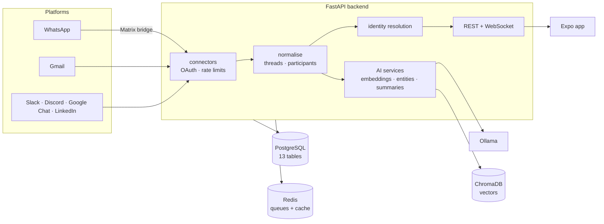

# Syncline

**Every conversation you have, in one searchable timeline.** Syncline pulls your messages out of WhatsApp, Gmail, Slack, Discord, Google Chat and LinkedIn, normalises them into one schema, resolves the same person across platforms, and puts semantic search, summaries and entity extraction on top — self-hosted, on your own machine.


## Why this exists

Your history with one person is scattered across six apps, and none of them will tell you what you agreed with them in March. The platforms have no reason to fix this — each one's product is the silo. Syncline is the version you run yourself: your messages land in your Postgres, embeddings are generated by a local Ollama model rather than an API you have to trust, and nothing leaves the machine unless you point it somewhere.

It started as a final-year project (internally *R.E.M.I*, "Multi-platform Event Stream Hub"), which is why some of the older docs still use those names.

## What it does

- **Connectors.** WhatsApp (via a Matrix bridge), Gmail, Slack, Discord, Google Chat and LinkedIn — each with OAuth token management, rate limiting and a shared `BaseConnector` contract. Telegram and Twitter/X are declared placeholders.
- **One message schema.** Raw platform payloads are kept, then normalised into messages, threads, participants, contacts and attachments (13 tables).
- **Identity resolution.** The same human across platforms gets matched into one contact, so a thread reads as a conversation rather than six feeds.
- **AI on your own hardware.** Embeddings and summaries through Ollama (OpenAI, OpenRouter and Anthropic are also wired up), vectors in ChromaDB, entity extraction with spaCy, PII redaction before anything is stored.
- **Real-time.** WebSocket API, an event bus, background sync workers and catch-up jobs for what you missed while offline.
- **88 REST endpoints** under `/api/v1` — health, auth, collection, messages, chats, contacts, threads, WhatsApp, AI.
- **A mobile client.** Expo / React Native with Tamagui: unified conversation view, search, daily summary, connection management.

## Architecture



## Getting started

**Requirements:** Python 3.11, Docker (Postgres, Redis, Ollama, ChromaDB, Synapse and the WhatsApp bridge all come up in Compose), Node 20+ for the app.

```bash
cd apps/backend
cp .env.example .env              # fill in the platform credentials you want
docker compose up -d              # postgres, redis, ollama, chromadb, synapse, whatsapp-bridge
pip install -r requirements.txt
alembic upgrade head
uvicorn main:app --reload         # http://localhost:8000/docs
```

The app:

```bash
cd apps/Syncline
npm install
npx expo start
```

Checks, the same ones CI runs:

```bash
cd apps/backend
black --check . && isort --profile black --check-only .
flake8 . --select=E9,F63,F7,F82
pytest tests/
```

## Project status

- ✅ `requirements.txt` installs on Linux again. It was a `pip freeze` from a Mac: 157 pyobjc bindings, plus a missing newline (`passlib==1.7.4qrcode[pil]==7.4.2`) that made pip reject the whole file, so **CI had been failing at install on every push**. 304 pins → 142.
- ✅ Backend formatted with black and isort, and those checks now gate the build instead of being `continue-on-error`.
- ✅ Security scans repointed at paths that exist (they were scanning `docker/`, `k8s/` and `helm/`, none of which are in this repo).
- 🟡 **Test suite state is being re-established.** It has not run in CI in a long time; treat the numbers as unknown until the pipeline reports.
- 🟡 Connector maturity varies a lot: WhatsApp is ~1,450 lines and heavily worked on, Telegram and Twitter/X are 51-line placeholders that say so.
- 🟡 The mobile app has several `*-demo` screens alongside the real ones.
- ⚠️ Self-host only — no hosted instance, and the WhatsApp path needs a Matrix homeserver and bridge running.
- 📌 ~100 docs under `docs/` and the app folders, some of them stale session notes rather than documentation.

## Tech stack

Python 3.11 · FastAPI · SQLAlchemy + Alembic · PostgreSQL · Redis · ChromaDB · Ollama · spaCy · Matrix/Synapse · Expo + React Native + Tamagui · Docker Compose · Kubernetes manifests · GitHub Actions

## Docs

[System overview](docs/SYSTEM_OVERVIEW.md) · [API reference](docs/API_REFERENCE.md) · [WebSocket API](docs/WEBSOCKET_API.md) · [AI setup](docs/AI_SETUP.md) · [WhatsApp architecture](docs/WHATSAPP_ARCHITECTURE.md) · [Deployment](docs/DEPLOYMENT_GUIDE.md) · [Multi-tenant architecture](docs/MULTI_TENANT_ARCHITECTURE.md) · [Runbooks](docs/OPERATIONAL_RUNBOOKS.md)

## License

MIT (declared in `apps/Syncline/package.json`; no root LICENSE file yet). Built by [Enoch (Enochthedev)](https://github.com/Enochthedev).
