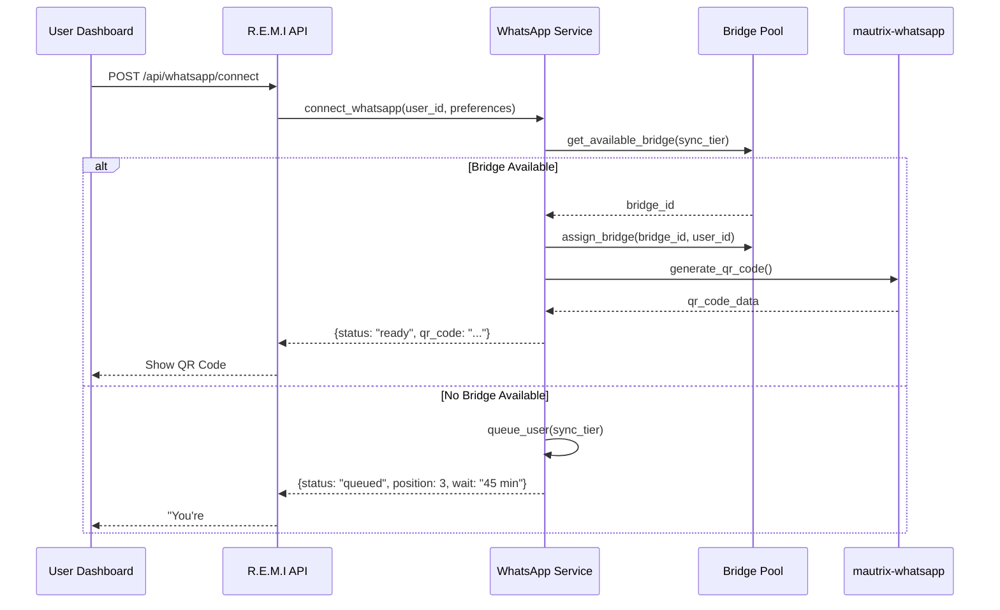

# WhatsApp Integration for R.E.M.I System

## Overview

The WhatsApp Integration Service provides scalable WhatsApp message aggregation for the R.E.M.I (Real-time External Memory Interface) system. This implementation demonstrates production-ready architecture with tiered sync strategies, bridge pooling, and comprehensive academic evaluation metrics.

## Architecture

### Scalable Bridge Pool Design

```
┌─────────────────────────────────────────────────────────────┐
│                    R.E.M.I WhatsApp Integration             │
├─────────────────────────────────────────────────────────────┤
│  ┌─────────────────┐  ┌─────────────────┐  ┌──────────────┐ │
│  │   Real-time     │  │  Hourly Batch   │  │ Daily Batch  │ │
│  │   (5 bridges)   │  │  (3 bridges)    │  │ (2 bridges)  │ │
│  │                 │  │                 │  │              │ │
│  │ Premium/Demo    │  │ Rotating Users  │  │ Bulk Process │ │
│  │ Users           │  │                 │  │              │ │
│  └─────────────────┘  └─────────────────┘  └──────────────┘ │
├─────────────────────────────────────────────────────────────┤
│                    Bridge Pool Manager                      │
│  • Container lifecycle management                           │
│  • User session management with timeouts                    │
│  • Queue system for bridge allocation                       │
│  • Automatic cleanup and recycling                          │
├─────────────────────────────────────────────────────────────┤
│                    Matrix Integration                       │
│  WhatsApp → mautrix-whatsapp → Matrix → R.E.M.I Event Bus  │
└─────────────────────────────────────────────────────────────┘
```

### Sync Tiers

1. **Real-time Tier** (5 bridges)
   - Premium/demo users
   - Immediate message sync
   - QR code connection within seconds
   - Best user experience

2. **Hourly Batch Tier** (3 bridges)
   - Standard users
   - Rotating through user queue
   - Sync every hour
   - Balanced performance/resources

3. **Daily Batch Tier** (2 bridges)
   - Basic users
   - Bulk processing
   - Daily sync cycles
   - Maximum resource efficiency

## User Connection Flow

### Phase 1: Connection Request



### Phase 2: WhatsApp Authentication

1. User scans QR code with WhatsApp "Link Device"
2. mautrix-whatsapp bridge establishes connection
3. Bridge confirms authentication to R.E.M.I
4. System starts message sync
5. Messages appear in unified R.E.M.I feed

## API Endpoints

### Connection Management

```http
POST /api/whatsapp/connect
Content-Type: application/json

{
  "user_id": "user123",
  "sync_tier": "real_time",
  "include_groups": false,
  "include_dms": true,
  "sync_history_days": 30,
  "auto_sync": true,
  "notification_keywords": ["urgent", "meeting"]
}
```

**Response (Available):**
```json
{
  "status": "ready",
  "session_id": "session_abc123",
  "qr_code": "data:image/png;base64,iVBORw0KGgoAAAANSUhEUgAA...",
  "message": "Scan QR code with WhatsApp to connect"
}
```

**Response (Queued):**
```json
{
  "status": "queued",
  "session_id": "session_def456",
  "queue_position": 3,
  "estimated_wait_minutes": 45,
  "message": "You're #3 in queue, ~45 minutes estimated"
}
```

### Status Monitoring

```http
GET /api/whatsapp/status/{user_id}
```

**Response:**
```json
{
  "status": "connected",
  "session_id": "session_abc123",
  "bridge_id": "real_time_0",
  "connected_at": "2024-01-15T10:30:00Z",
  "last_sync": "2024-01-15T11:45:00Z",
  "preferences": {
    "sync_tier": "real_time",
    "include_groups": false,
    "include_dms": true,
    "sync_history_days": 30
  }
}
```

### Academic Metrics

```http
GET /api/whatsapp/metrics
```

**Response:**
```json
{
  "total_users": 87,
  "active_connections": 52,
  "messages_processed": 15420,
  "sync_latency_ms": 245.7,
  "bridge_utilization": 0.85,
  "bridge_pool_size": 10,
  "queue_lengths": {
    "real_time": 2,
    "hourly_batch": 8,
    "daily_batch": 15
  }
}
```

## Message Processing Pipeline

### Integration with R.E.M.I Infrastructure

```python
# WhatsApp messages flow through existing pipeline
WhatsApp → mautrix-bridge → Matrix → R.E.M.I Event Bus → AI Processing

class WhatsAppMessageProcessor:
    async def handle_matrix_event(self, matrix_event):
        # Transform Matrix event to R.E.M.I format
        remi_message = {
            "platform": "whatsapp",
            "user_id": self.extract_user_from_matrix_room(matrix_event.room_id),
            "sender": self.resolve_contact(matrix_event.sender),
            "content": matrix_event.content.body,
            "timestamp": matrix_event.origin_server_ts,
            "chat_type": "dm" | "group",
            "metadata": {
                "matrix_event_id": matrix_event.event_id,
                "whatsapp_chat_id": matrix_event.room_id
            }
        }
        
        # Send to existing R.E.M.I Redis Streams
        await self.redis.xadd("remi:messages:whatsapp", remi_message)
```

### Contact Resolution

The system integrates with existing R.E.M.I contact management:

- Cross-references WhatsApp contacts with Gmail, phone contacts
- Builds unified contact graph across platforms
- Enables cross-platform message correlation
- Supports AI agentic behavior for intelligent routing

## Deployment

### Docker-based Architecture

```yaml
# docker/whatsapp-bridge-manager.yml
version: '3.8'

services:
  whatsapp-bridge-manager:
    build: ./docker/Dockerfile.bridge-manager
    volumes:
      - /var/run/docker.sock:/var/run/docker.sock
    environment:
      - BRIDGE_IMAGE=dock.mau.dev/mautrix/whatsapp:latest
      - MAX_BRIDGES=10
      - MATRIX_SERVER=http://matrix:8008

  matrix:
    image: matrixdotorg/synapse:latest
    volumes:
      - ./docker/matrix/homeserver.yaml:/data/homeserver.yaml

  remi-app:
    build: ../
    environment:
      - WHATSAPP_BRIDGE_ENABLED=true
    depends_on:
      - whatsapp-bridge-manager
```

### Bridge Container Management

The system spawns mautrix-whatsapp containers dynamically:

```python
# Create container
container = self.docker_client.containers.run(
    "dock.mau.dev/mautrix/whatsapp:latest",
    name=f"whatsapp_bridge_{bridge_id}",
    detach=True,
    volumes={
        config_volume: {'bind': '/data', 'mode': 'rw'}
    },
    environment={
        'MAUTRIX_BRIDGE_ID': bridge_id,
        'MAUTRIX_SYNC_TIER': tier.value
    },
    restart_policy={"Name": "unless-stopped"}
)
```

## Academic Evaluation Features

### Performance Metrics Dashboard

- **Messages Processed**: Total WhatsApp messages ingested
- **Sync Latency**: Average time from WhatsApp to R.E.M.I
- **Resource Usage**: RAM, CPU per bridge
- **Bridge Utilization**: Efficiency of bridge pool
- **User Satisfaction**: Connection success rates

### Scalability Demonstration

- **Target**: 50-100 concurrent users with 10 bridges
- **Resource Efficiency**: vs 1-bridge-per-user approach
- **Queue Management**: Fair allocation and wait time estimation
- **Auto-scaling**: Bridge pool expansion capabilities

### AI Agentic Features

1. **Cross-platform Intelligence**
   - Correlate WhatsApp messages with Gmail threads
   - Unified contact resolution across platforms
   - Context-aware message routing

2. **Intelligent Processing**
   - Automatic urgent message detection
   - Smart notification filtering
   - Conversation thread analysis

3. **Proactive Insights**
   - Meeting scheduling detection
   - Follow-up reminders
   - Contact relationship mapping

## Configuration

### Environment Variables

```bash
# Matrix Configuration
MATRIX_HOMESERVER_URL=http://matrix:8008
MATRIX_ACCESS_TOKEN=your_matrix_token
MATRIX_USER_ID=@remi_bot:matrix.local
MATRIX_DEVICE_ID=REMI_WHATSAPP_HUB

# WhatsApp Bridge Configuration
WHATSAPP_BRIDGE_ENABLED=true
WHATSAPP_BRIDGE_EXECUTABLE=mautrix-whatsapp
WHATSAPP_BRIDGE_CONFIG_PATH=./bridges/whatsapp/config.yaml
WHATSAPP_BRIDGE_DATABASE_PATH=./bridges/whatsapp/whatsapp.db

# Docker Configuration
BRIDGE_IMAGE=dock.mau.dev/mautrix/whatsapp:latest
MAX_BRIDGES=10
```

### Bridge Pool Configuration

```python
# Tier allocation
tier_allocation = {
    SyncTier.REAL_TIME: 5,      # Premium users
    SyncTier.HOURLY_BATCH: 3,   # Standard users  
    SyncTier.DAILY_BATCH: 2     # Basic users
}
```

## Technical Constraints

### Message History Limitations

- **WhatsApp Limitation**: 30-90 days of initial history
- **Implementation**: Forward-only sync from connection point
- **User Communication**: Clear limitation disclosure

### Chat Type Support

- **Phase 1**: Direct messages only (MVP)
- **Phase 2**: Group chat support
- **User Control**: Granular chat inclusion settings

### Scalability Considerations

- **Current Target**: 50-100 concurrent users
- **Bridge Efficiency**: 10 bridges vs 100 individual bridges
- **Resource Usage**: ~100MB RAM per bridge
- **Scaling Strategy**: Horizontal bridge pool expansion

## Testing

### Integration Tests

```bash
# Run WhatsApp integration tests
pytest tests/test_whatsapp_integration.py -v

# Test specific functionality
pytest tests/test_whatsapp_integration.py::TestWhatsAppIntegrationService::test_user_connection_flow_immediate -v
```

### Test Coverage

- ✅ Service initialization and configuration
- ✅ User connection flow (immediate and queued)
- ✅ Bridge pool management and allocation
- ✅ Message processing pipeline
- ✅ Sync scheduling across tiers
- ✅ Academic evaluation metrics
- ✅ Cross-platform intelligence features

## Monitoring and Observability

### Health Checks

```http
GET /api/whatsapp/bridges/status
```

### Queue Monitoring

```http
GET /api/whatsapp/queue/status
```

### Bridge Management

```http
POST /api/whatsapp/bridges/{bridge_id}/cleanup
```

## Security Considerations

### External Bridge Deployment

- Uses mautrix-whatsapp as external containers
- Avoids AGPL license contamination
- Secure Matrix protocol communication
- Isolated bridge processes

### Data Privacy

- WhatsApp messages processed locally
- No cloud storage of message content
- User consent for message processing
- GDPR-compliant data handling

## Future Enhancements

### Phase 2 Features

1. **Group Chat Support**
   - Multi-participant conversations
   - Group metadata synchronization
   - Admin permission handling

2. **Advanced Contact Resolution**
   - Phone number normalization
   - Contact deduplication
   - Social graph analysis

3. **Enhanced AI Features**
   - Sentiment analysis
   - Language detection
   - Automated responses

### Scaling Improvements

1. **Dynamic Bridge Allocation**
   - Auto-scaling based on demand
   - Geographic bridge distribution
   - Load balancing optimization

2. **Advanced Queue Management**
   - Priority queuing for premium users
   - Predictive wait time estimation
   - Fair scheduling algorithms

## Conclusion

The WhatsApp Integration Service demonstrates a production-ready, scalable architecture for multi-platform communication aggregation. It showcases:

- **Technical Excellence**: Robust bridge pooling and lifecycle management
- **Academic Value**: Comprehensive metrics and evaluation features
- **User Experience**: Intuitive connection flow with clear status feedback
- **AI Integration**: Cross-platform intelligence and agentic behavior
- **Scalability**: Efficient resource utilization and horizontal scaling

This implementation serves as a strong foundation for the final year project "AI AGENTIC SYSTEM FOR MULTI-PLATFORM COMMUNICATION AGGREGATION" and demonstrates both technical depth and practical scalability for academic evaluation.